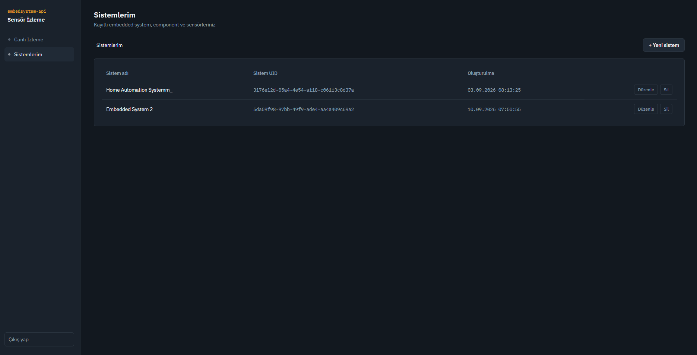
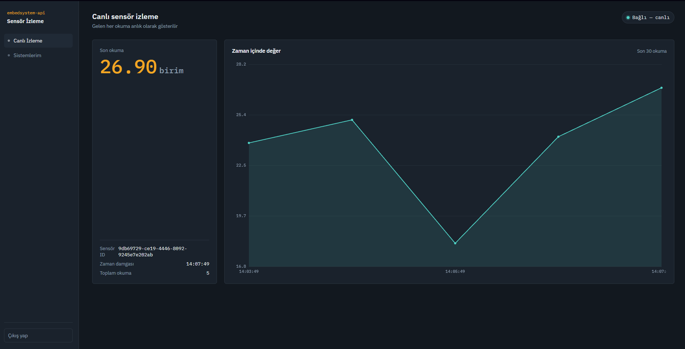
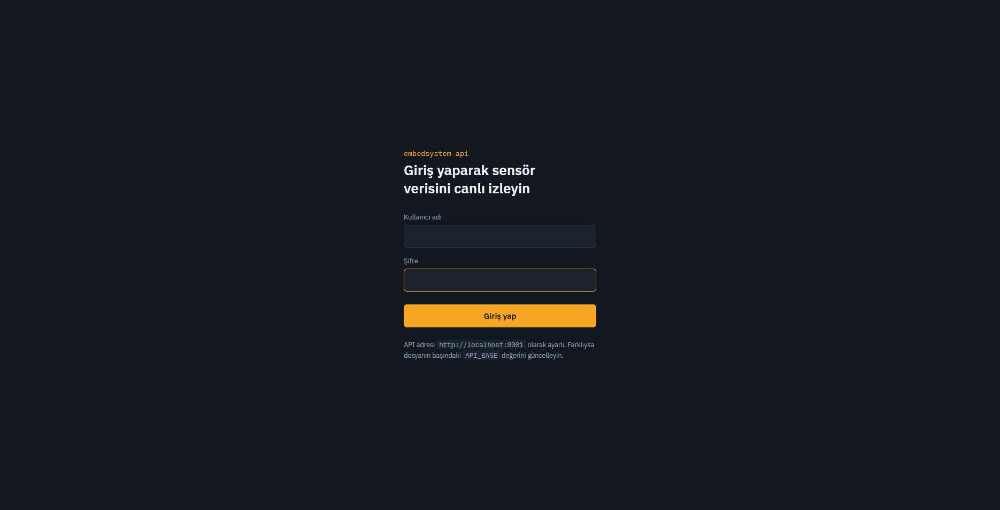

# Embedded System Control API

A scalable and modular backend API designed for **embedded system and sensor management**. The project provides a secure and extensible infrastructure for managing users, roles, sensors, real-time sensor data, background tasks, email verification, caching, and system monitoring.

The application is built with a **layered architecture** and is fully containerized using Docker. It combines PostgreSQL, Redis, RabbitMQ, WebSocket communication, JWT-based authentication, localization, and Sentry monitoring to provide a reliable backend infrastructure for embedded-system applications.

---

## 🚀 Features

* Layered and modular application architecture
* RESTful API built with FastAPI
* PostgreSQL relational database
* SQLAlchemy ORM
* Alembic database migrations
* Docker & Docker Compose based infrastructure
* JWT-based authentication
* Role and permission management
* Role information included in access tokens
* Email verification during registration
* RabbitMQ-based asynchronous task processing
* Redis-based caching
* In-memory and distributed caching mechanisms
* Localization / multi-language support
* WebSocket-based real-time sensor data streaming
* Background workers for asynchronous operations
* Sentry-based error monitoring and notifications
* Virtual sensor simulation
* Relational database design with foreign-key relationships

---
# 🖥️ Frontend Preview

The backend API is integrated with a frontend application that provides a user-friendly interface for interacting with the embedded system and monitoring sensor data.

### Dashboard

The dashboard provides an overview of the system and allows users to interact with the available resources.


### Real-Time Sensor Monitoring

Sensor data can be monitored in real time through the frontend using the WebSocket connection provided by the backend.


### Authentication

The frontend also provides the authentication interface used for user registration and login.


<h1>🖥️ Frontend Preview</h1>

<p align="center">
  
  
  
</p>

---

# 🏗️ Architecture

The application follows a **layered architecture** to keep business logic, data access, API endpoints, and infrastructure concerns separated from each other.

The main goal of this architecture is to make the system:

* Maintainable
* Testable
* Scalable
* Easier to extend
* Less coupled

A simplified request flow can be represented as:

```text
Client
   │
   ▼
API / Router Layer
   │
   ▼
Service Layer
   │
   ▼
Repository / Data Access Layer
   │
   ▼
SQLAlchemy ORM
   │
   ▼
PostgreSQL
```

Infrastructure components such as Redis, RabbitMQ, WebSocket connections, and monitoring services are integrated independently from the core business logic.

This separation makes it possible to change or extend individual components without significantly affecting the rest of the application.

---

# ⚡ FastAPI

The API layer is implemented using **FastAPI**, providing a modern asynchronous web framework for building RESTful APIs.

FastAPI is used for:

* User authentication
* User and role management
* Sensor management
* Sensor data operations
* API validation
* WebSocket communication
* Dependency injection
* HTTP request handling

The application is served through Uvicorn.

---

# 🗄️ PostgreSQL Database

The project uses **PostgreSQL** as its primary relational database.

PostgreSQL stores persistent application data such as:

* Users
* Roles
* Permissions
* Sensors
* Sensor-related information
* Sensor data
* Other relational entities

The database layer is implemented using **SQLAlchemy**, providing an abstraction between the application and PostgreSQL.

Database schema changes are managed using **Alembic** migrations.

```text
FastAPI
   │
   ▼
SQLAlchemy
   │
   ▼
PostgreSQL
```

The Docker Compose configuration uses PostgreSQL 16 and automatically runs the latest Alembic migrations when the API container starts.

---

# 🔗 Relational Database Design

The database follows a relational model where entities are connected using appropriate relationships and foreign keys.

For example, users, roles, permissions, sensors, and related entities are represented as separate database structures rather than storing unrelated information in a single table.

This approach provides:

* Data consistency
* Referential integrity
* Reduced duplication
* Easier querying
* Clear entity relationships
* Better scalability

SQLAlchemy is responsible for mapping these relational structures to Python models.

---

# 🔐 Authentication & Authorization

The application implements authentication using **JWT (JSON Web Tokens)**.

After successful authentication, the API generates an access token containing the information required to identify and authorize the user.

The access token includes the user's **role information**, allowing the API to perform authorization checks without requiring the role to be retrieved from the database on every request.

The general authentication flow is:

```text
User
 │
 │ Login
 ▼
Authentication
 │
 ▼
JWT Access Token
 │
 ├── User Identity
 ├── Role
 └── Token Metadata
 │
 ▼
Protected API Endpoint
 │
 ▼
Authorization Check
```

This provides a centralized authentication and authorization mechanism for protected endpoints.

---

# 👥 Role & Permission Management

The project includes a role-based authorization mechanism.

Users can be associated with specific roles, and access to protected resources can be controlled according to these roles.

Role information is embedded directly into the JWT access token.

This allows protected endpoints to perform authorization checks based on the authenticated user's claims.

```text
Authentication
      │
      ▼
   JWT Token
      │
      ├── User ID
      └── Role
            │
            ▼
     Authorization
            │
            ▼
      API Resource
```

This structure makes the authorization layer easier to maintain and extend when new roles or protected resources are introduced.

---

# 📧 Email Verification

The registration process includes an **email verification mechanism**.

Instead of sending the verification email directly during the registration request, the application uses **RabbitMQ** to process the email operation asynchronously.

The flow is approximately:

```text
User Registration
       │
       ▼
Create User
       │
       ▼
Publish Email Task
       │
       ▼
RabbitMQ
       │
       ▼
Email Worker
       │
       ▼
Verification Email
       │
       ▼
User
```

This prevents email delivery from blocking the main registration request.

The dedicated `email-worker` service consumes email-related messages from RabbitMQ and handles the actual email delivery.

---

# 🐇 RabbitMQ & Message Queues

The project uses **RabbitMQ** as its message broker for asynchronous communication between different components.

RabbitMQ is used to decouple time-consuming or background operations from the API request lifecycle.

The project includes separate workers for background processing, including:

* Email processing
* Sensor-related processing

The Docker Compose configuration defines RabbitMQ together with dedicated `email-worker`, `sensor-worker`, and virtual sensor services.

This architecture allows background tasks to be processed independently from the API.

```text
                    ┌───────────────┐
                    │      API      │
                    └───────┬───────┘
                            │
                            ▼
                    ┌───────────────┐
                    │   RabbitMQ    │
                    └───────┬───────┘
                            │
              ┌─────────────┴─────────────┐
              ▼                           ▼
      ┌───────────────┐           ┌───────────────┐
      │ Email Worker  │           │ Sensor Worker │
      └───────────────┘           └───────────────┘
```

---

# ⚡ Redis & Caching

The application uses **Redis** as a distributed caching solution.

Caching is used to reduce unnecessary database operations and improve application responsiveness.

The project supports both:

### In-Memory Cache

Data can be temporarily stored inside application memory when a local cache is sufficient.

```text
Application
    │
    ▼
Memory Cache
```

### Distributed Cache

Redis provides a shared cache that can be accessed by multiple application instances.

```text
              ┌─────────────┐
              │ Application │
              └──────┬──────┘
                     │
                     ▼
                ┌─────────┐
                │  Redis  │
                └─────────┘
```

Using both caching approaches makes it possible to choose between extremely fast local caching and shared distributed caching depending on the use case.

The Docker infrastructure includes Redis 7 as a dedicated service.

---

# 🌍 Localization

The application includes a **localization / language management structure**.

This allows application responses and messages to be handled according to the selected language.

The localization layer is designed to keep language-specific messages separated from the application logic.

Instead of hard-coding user-facing messages directly into business logic, the application can resolve messages through the localization mechanism.

This provides a foundation for supporting multiple languages without duplicating business logic.

---

# 📡 Real-Time Sensor Data with WebSockets

One of the main features of the project is the ability to display **sensor data in real time**.

Traditional REST APIs require the frontend to repeatedly request the latest sensor data.

Instead, this project uses **WebSocket communication** to establish a persistent connection between the frontend and backend.

```text
Sensor
  │
  ▼
Backend
  │
  ▼
WebSocket Connection
  │
  ▼
Frontend
  │
  ▼
Real-Time Sensor Data
```

When new sensor data becomes available, it can be pushed to the frontend through the WebSocket connection.

This allows the frontend to display live sensor values without continuously polling the API.

The project also includes a virtual sensor service for generating sensor-related data during development and testing.

---

# 📊 Sensor Processing

The system is designed around embedded-system and sensor management.

Sensor-related operations can be processed asynchronously through the RabbitMQ messaging infrastructure.

A dedicated sensor worker is responsible for consuming and processing sensor-related messages.

This makes the sensor processing pipeline independent from the main API process.

```text
Sensor / Virtual Sensor
          │
          ▼
      RabbitMQ
          │
          ▼
    Sensor Worker
          │
          ▼
     Application
          │
          ▼
      WebSocket
          │
          ▼
       Frontend
```

---

# 🛡️ Error Monitoring with Sentry

The project integrates **Sentry** for application error monitoring.

Sentry allows runtime errors and exceptions to be captured and monitored in a centralized environment.

When an error occurs, the system can:

* Capture the exception
* Provide error details
* Track where the error occurred
* Monitor application failures
* Notify the development team through email

This makes debugging and production monitoring easier.

The project includes the `sentry-sdk` dependency for integrating Sentry into the application.

---

# 🐳 Dockerized Infrastructure

The entire backend infrastructure is designed to run through **Docker Compose**.

Instead of installing every dependency manually on the host machine, the required services can be started as isolated containers.

The current Docker Compose setup includes:

```text
┌─────────────────────────────────────────┐
│              Docker Compose             │
│                                         │
│  ┌─────────┐      ┌─────────┐           │
│  │   API   │      │Postgres │           │
│  └─────────┘      └─────────┘           │
│                                         │
│  ┌─────────┐      ┌───────────┐         │
│  │  Redis  │      │ RabbitMQ  │         │
│  └─────────┘      └───────────┘         │
│                                         │
│  ┌─────────────┐  ┌──────────────┐      │
│  │Email Worker │  │ Sensor Worker│      │
│  └─────────────┘  └──────────────┘      │
│                                         │
│  ┌──────────────────────────┐           │
│  │     Virtual Sensor       │           │
│  └──────────────────────────┘           │
└─────────────────────────────────────────┘
```

The repository defines PostgreSQL, Redis, RabbitMQ, the API, email worker, sensor worker, and virtual sensor as Docker Compose services.

The API container also waits for PostgreSQL, Redis, and RabbitMQ health checks before starting. Database migrations are then applied automatically using Alembic.

---

# 🧩 Project Structure

The project is organized into separate application and infrastructure components.

A simplified structure is:

```text
Embedded-System-Control-API/
│
├── app/
│   ├── ...
│   └── ...
│
├── alembic/
│   └── ...
│
├── logs/
│
├── Dockerfile
├── docker-compose.yml
├── alembic.ini
├── requirements.txt
└── .dockerignore
```

The repository separates the application code from database migrations and deployment-related configuration.

---

# 🛠️ Technologies

| Technology         | Purpose                        |
| ------------------ | ------------------------------ |
| **Python**         | Main programming language      |
| **FastAPI**        | REST API framework             |
| **Uvicorn**        | ASGI server                    |
| **PostgreSQL**     | Relational database            |
| **SQLAlchemy**     | ORM / database abstraction     |
| **Alembic**        | Database migrations            |
| **JWT**            | Authentication                 |
| **Redis**          | Distributed caching            |
| **RabbitMQ**       | Message broker / task queue    |
| **WebSockets**     | Real-time sensor communication |
| **Docker**         | Containerization               |
| **Docker Compose** | Multi-container orchestration  |
| **Sentry**         | Error monitoring               |
| **Pydantic**       | Data validation and settings   |

These technologies are reflected in the project's dependency configuration and Docker infrastructure.

---

# ▶️ Running the Project

## Prerequisites

Make sure the following are installed:

* Docker
* Docker Compose
* Git

Clone the repository:

```bash
git clone https://github.com/HanN-Kun/Embedded-System-Control-API.git

cd Embedded-System-Control-API
```

Create the required environment configuration and provide the necessary values for secrets, RabbitMQ, Gmail, Sentry, and virtual sensor configuration.

Then start the complete infrastructure:

```bash
docker compose up --build
```

This starts the API together with PostgreSQL, Redis, RabbitMQ, background workers, and the virtual sensor service.

---

# 🔄 Overall System Flow

The complete architecture can be summarized as follows:

```text
                         ┌─────────────────┐
                         │    Frontend     │
                         └────────┬────────┘
                                  │
                    ┌─────────────┴─────────────┐
                    │                           │
                 REST API                  WebSocket
                    │                           │
                    ▼                           │
              ┌───────────┐                     │
              │  FastAPI  │                     │
              └─────┬─────┘                     │
                    │                           │
          ┌─────────┼──────────┐                │
          │         │          │                │
          ▼         ▼          ▼                │
     PostgreSQL   Redis     RabbitMQ             │
          │         │          │                │
          │         │     ┌────┴─────┐           │
          │         │     │          │           │
          │         │     ▼          ▼           │
          │         │  Email      Sensor         │
          │         │  Worker      Worker        │
          │         │     │          │           │
          │         │     ▼          ▼           │
          │         │   Email     Sensor Data ───┘
          │         │
          └─────────┴───────────────────────────┐
                                                │
                                            Sentry
                                                │
                                                ▼
                                        Error Monitoring
```

---

# 🎯 Project Goals

The primary goal of this project is to provide a **production-oriented backend architecture for embedded systems and real-time sensor applications**.

The project focuses on combining:

* Clean separation of application layers
* Secure authentication and authorization
* Reliable relational data management
* Asynchronous background processing
* Distributed caching
* Real-time communication
* Containerized infrastructure
* Localization
* Application monitoring

into a single cohesive backend system.

The architecture is designed so that individual components can be scaled, replaced, or extended independently as the system grows.

---

# 📌 Key Architectural Concepts

This project demonstrates practical implementation of several backend engineering concepts:

**Layered Architecture**
Separates API, business, data-access, and infrastructure responsibilities.

**Relational Database Design**
Uses PostgreSQL and SQLAlchemy to model structured relationships between entities.

**Authentication & Authorization**
Uses JWT-based authentication with role information included in access tokens.

**Caching**
Combines local in-memory caching with distributed Redis caching.

**Asynchronous Processing**
Uses RabbitMQ to move background operations away from synchronous API requests.

**Event-Driven Email Verification**
Registration-related email verification is handled asynchronously through RabbitMQ.

**Real-Time Communication**
WebSockets provide live sensor data updates to the frontend.

**Observability**
Sentry provides centralized error tracking and notification.

**Containerization**
Docker Compose packages the API, database, cache, message broker, workers, and virtual sensor into an easily reproducible development environment.

---

# 📄 License

This project is currently available as an open-source repository on GitHub.

For more information, visit the repository:

[Embedded System Control API — GitHub Repository](https://github.com/HanN-Kun/Embedded-System-Control-API?utm_source=chatgpt.com)
